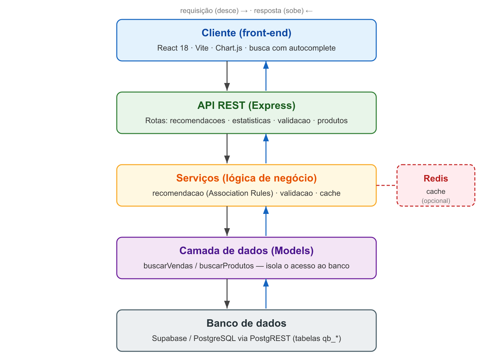
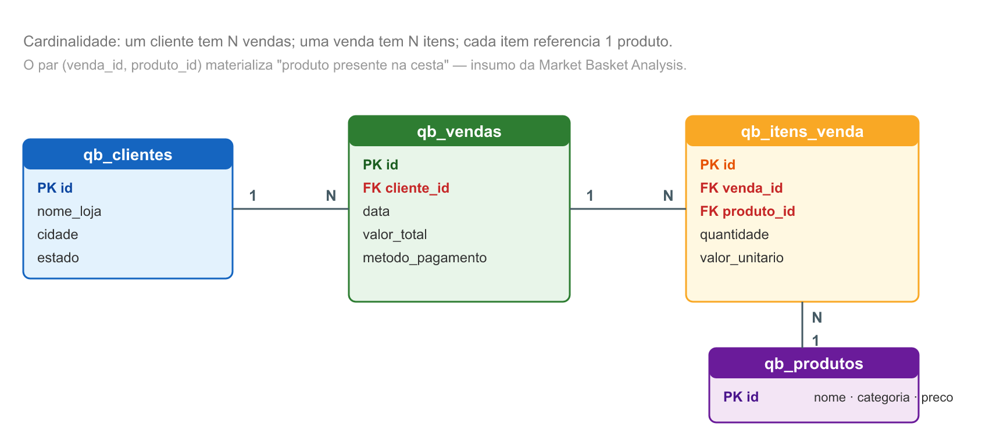
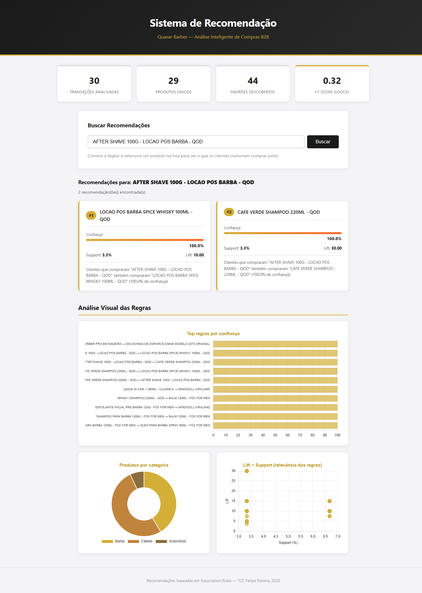

# 4 DESENVOLVIMENTO DO SISTEMA

Este capítulo descreve o artefato construído — a concretização da atividade de "projeto e desenvolvimento" da DSR (Seção 3.2). Apresenta-se a arquitetura geral (Seção 4.1), a modelagem dos dados (Seção 4.2), a camada de integração com o banco (Seção 4.3), a implementação do algoritmo de regras de associação (Seção 4.4) e da geração de recomendações Top-N (Seção 4.5), a API REST (Seção 4.6), o cache (Seção 4.7), a interface web (Seção 4.8) e, por fim, as principais decisões de projeto e seus *trade-offs* (Seção 4.9).

## 4.1 Arquitetura geral

O sistema adota uma arquitetura em camadas, com separação clara de responsabilidades entre cliente, servidor e persistência. O fluxo de uma requisição percorre os seguintes estágios:

> **Cliente (React)** → **API REST (Express)** → **Serviços** → **Camada de dados (Models)** → **Banco (Supabase/PostgreSQL)**

A interface web (*front-end*), construída em React, consome uma API REST exposta por um servidor Node.js/Express (*back-end*). O servidor organiza-se internamente em três camadas: as **rotas**, que recebem as requisições HTTP e validam parâmetros; os **serviços**, que concentram a lógica de negócio (o algoritmo de recomendação, a validação e o cache); e os **modelos** (*models*), que isolam todo o acesso ao banco de dados. Essa estratificação garante que uma alteração no banco — ou mesmo a troca da plataforma de persistência — afete apenas a camada de modelos, sem repercutir nas rotas ou na interface.

**Figura 1 — Arquitetura em camadas do sistema**



Fonte: elaborado pelo autor (2026).

## 4.2 Modelagem de dados

O modelo de dados relacional representa o domínio da distribuidora em quatro tabelas, prefixadas por `qb_` para isolá-las de outros objetos que compartilham o mesmo projeto Supabase. O Quadro 3 descreve cada entidade.

**Quadro 3 — Tabelas do modelo de dados**

| Tabela | Descrição | Principais campos |
|---|---|---|
| `qb_clientes` | Barbearias e compradores atendidos pela distribuidora | `id`, `nome_loja`, `cidade`, `estado` |
| `qb_produtos` | Catálogo de produtos | `id`, `nome`, `categoria`, `preco`, `ativo` |
| `qb_vendas` | Cabeçalho de cada venda (transação) | `id`, `cliente_id`, `data`, `valor_total`, `metodo_pagamento` |
| `qb_itens_venda` | Itens que compõem cada venda | `id`, `venda_id`, `produto_id`, `quantidade`, `valor_unitario` |

Fonte: elaborado pelo autor (2026).

O relacionamento central liga `qb_vendas` a `qb_itens_venda` (um-para-muitos: uma venda contém vários itens) e `qb_itens_venda` a `qb_produtos` (muitos-para-um: cada item referencia um produto). É justamente o par (`venda_id`, `produto_id`) que materializa a noção de "produto presente em uma cesta", insumo direto da *Market Basket Analysis*.

**Figura 2 — Diagrama entidade-relacionamento (ER) das tabelas `qb_*`**



Fonte: elaborado pelo autor (2026).

A carga dos dados pré-processados (Seção 3.4) no banco é realizada por um *script* dedicado, `seed-csv.js`, que executa as etapas de limpeza, agrupa os itens por pedido, infere as categorias, insere clientes e produtos de forma idempotente (evitando duplicatas) e, por fim, grava vendas e itens. O *script* oferece ainda a opção de reinicialização completa das tabelas, empregada ao substituir o conjunto de dados por uma exportação atualizada.

## 4.3 Camada de dados e integração com o Supabase

O acesso ao banco é feito por meio do cliente JavaScript do Supabase, que opera sobre o **PostgREST** — uma camada que expõe o PostgreSQL como API REST. Optou-se por essa via, em vez de uma conexão SQL direta, porque a camada gratuita do Supabase disponibiliza o acesso REST com uma chave pública (*anon key*), suficiente para as operações de leitura requeridas pelo algoritmo, dispensando a gestão de credenciais de conexão e *pool*.

A consulta mais importante da camada de modelos é a que recupera todas as transações no formato esperado pelo algoritmo. O PostgREST realiza o *join* entre `qb_itens_venda` e `qb_produtos` por meio da chave estrangeira, retornando uma linha por item; o agrupamento por venda é então efetuado em memória, reconstruindo cada transação como um objeto com seu vetor de itens, conforme ilustra o Código-fonte 1.

**Código-fonte 1 — Recuperação e agrupamento das transações (`models/index.js`)**

```javascript
async function buscarVendas() {
  const { data, error } = await supabase
    .from('qb_itens_venda')
    .select(`venda_id, quantidade, valor_unitario,
             qb_produtos (id, nome, categoria)`);
  if (error) throw new Error(error.message);

  const vendasMap = {};
  for (const item of data) {
    if (!vendasMap[item.venda_id]) {
      vendasMap[item.venda_id] = { id: item.venda_id, itens: [] };
    }
    vendasMap[item.venda_id].itens.push({
      nome_produto: item.qb_produtos.nome,
      produto_id: item.qb_produtos.id,
      categoria: item.qb_produtos.categoria,
    });
  }
  return Object.values(vendasMap);
}
```

Fonte: elaborado pelo autor (2026).

No que tange à segurança, as tabelas operam com *Row Level Security* (RLS) habilitado: a chave pública concede apenas leitura, enquanto as operações de escrita (a carga de dados) exigem uma chave de serviço privada, restrita ao ambiente do servidor e nunca exposta ao cliente.

## 4.4 Algoritmo de regras de associação

O núcleo do sistema é a função `calculateAssociation`, que implementa uma versão simplificada da extração de regras de associação, restrita a regras de **um item no antecedente e um no consequente** ($A \Rightarrow B$). Essa simplificação é deliberada e justifica-se pelo porte do conjunto de dados: com dezenas de transações, regras multi-item teriam suporte demasiado baixo para serem confiáveis, e o custo computacional da geração par-a-par é plenamente absorvível (discussão na Seção 4.9).

Para cada par ordenado de produtos distintos $(A, B)$, o algoritmo conta as transações que contêm $A$, as que contêm $A$ e $B$ simultaneamente e as que contêm $B$, e a partir dessas contagens calcula as três métricas definidas na Seção 2.2.3 — suporte, confiança e *lift*. São retidas apenas as regras que satisfazem simultaneamente os limiares mínimos de confiança e suporte. O Código-fonte 2 reproduz o cerne desse processamento.

**Código-fonte 2 — Cálculo das métricas por par de produtos (`services/recomendacao.js`)**

```javascript
const confidence = transacoesComAeB.length / transacoesComA.length;
const support    = transacoesComAeB.length / totalTransacoes;

if (confidence >= minConfidence && support >= minSupport) {
  const supportB = transacoesComB.length / totalTransacoes;
  const lift = supportB > 0 ? confidence / supportB : 0;
  regras.push({
    antecedente: produtoA, consequente: produtoB,
    confidence, support, lift,
    frequencia: transacoesComAeB.length,
  });
}
```

Fonte: elaborado pelo autor (2026).

Os limiares são centralizados em um único arquivo de configuração, com os valores definidos para o estudo: confiança mínima de **0,30**, suporte mínimo de **0,02**, *lift* mínimo de **1,0** e número de recomendações **Top-N igual a 3**. A escolha desses valores e seu efeito sobre o conjunto de regras são analisados no Capítulo 5. Ao final, as regras são ordenadas por confiança decrescente, o que simplifica a etapa de geração de recomendações.

## 4.5 Geração de recomendações Top-N

A geração de recomendações é separada do cálculo das regras, o que permite reaproveitar o mesmo conjunto de regras para múltiplas consultas sem recalculá-las. Dada a identificação de um produto, a função `obterRecomendacoes` filtra as regras cujo antecedente corresponde ao produto consultado e retorna as $N$ primeiras — que, por já estarem ordenadas por confiança, são as mais fortes. O parâmetro $N$, fixado em 3, equilibra a relevância das sugestões com a clareza da interface, evitando sobrecarregar o usuário com recomendações de baixa confiança.

## 4.6 API REST

A lógica do sistema é exposta por uma API REST organizada em quatro grupos de rotas, além de um *endpoint* de verificação de integridade. O Quadro 4 sintetiza os pontos de acesso.

**Quadro 4 — Endpoints da API REST**

| Método e rota | Função |
|---|---|
| `GET /health` | Verificação de disponibilidade do servidor |
| `GET /api/recomendacoes/:produtoId` | Recomendações Top-N para um produto |
| `GET /api/estatisticas` | Métricas globais (total de regras, médias de confiança/suporte) |
| `GET /api/validacao` | Precision, Recall e F1-Score |
| `GET /api/produtos?q=<termo>` | Busca parcial de produtos (autocomplete) |

Fonte: elaborado pelo autor (2026).

Cada grupo de rotas delega a lógica aos serviços correspondentes, mantendo as rotas enxutas e focadas no protocolo HTTP — validação de parâmetros, códigos de *status* e serialização da resposta em JSON. O servidor é configurado com CORS restrito ao domínio do *front-end*, e sua inicialização é separada da definição da aplicação, o que permite que os testes de integração importem a aplicação sem subir uma porta de rede.

## 4.7 Cache com degradação graceful

Como o cálculo das regras percorre todas as transações a cada requisição, introduziu-se uma camada de cache em Redis que memoriza os resultados por um período determinado (uma hora para recomendações; trinta minutos para estatísticas, que variam com mais frequência). A consulta primeiro verifica o cache; em caso de acerto, devolve o resultado memorizado; em caso de falha, calcula, armazena e retorna.

O aspecto distintivo do projeto é a **degradação graceful**: o Redis é tratado como dependência **opcional**. Caso o servidor de cache esteja indisponível — situação comum em ambiente de desenvolvimento —, as operações de leitura e escrita no cache falham silenciosamente, e o sistema simplesmente recalcula as regras a cada requisição. Há perda de desempenho, mas nunca de corretude ou disponibilidade. Essa decisão reduz a barreira de instalação e adequa-se ao perfil de baixa infraestrutura visado pelo trabalho.

## 4.8 Interface web

A interface, desenvolvida em React com *build* via Vite, materializa-se em um painel (*dashboard*) que reúne as funcionalidades de consulta. Seus principais componentes são:

- **Busca de produto com autocomplete** — à medida que o usuário digita, o componente consulta o *endpoint* de busca parcial e exibe sugestões de produtos correspondentes, dispensando o conhecimento do nome exato.
- **Cartões de recomendação** — para o produto selecionado, apresentam-se as recomendações Top-N, cada qual acompanhada de suas métricas de confiança, suporte e *lift*, tornando a sugestão interpretável pela equipe de vendas.
- **Gráficos das regras** — por meio da biblioteca Chart.js, visualizam-se as regras de maior destaque e a distribuição das métricas, conferindo uma leitura agregada dos padrões descobertos.

**Figura 3 — Painel principal do sistema**



Fonte: elaborado pelo autor (2026).

A comunicação com a API é centralizada em um módulo de serviço do *front-end*, e o ambiente de desenvolvimento utiliza o *proxy* do Vite para encaminhar as chamadas ao servidor Express, evitando questões de CORS durante o desenvolvimento.

## 4.9 Decisões de projeto e *trade-offs*

O desenvolvimento envolveu escolhas conscientes, ditadas pelo contexto de baixo volume de dados e baixo custo de infraestrutura. As principais são sintetizadas a seguir.

**Extração par-a-par em vez do Apriori completo.** A literatura aponta o Apriori (AGRAWAL; SRIKANT, 1994) e o FP-Growth (HAN; PEI; YIN, 2000) como algoritmos canônicos para a mineração de itemsets de qualquer cardinalidade. Optou-se, contudo, por restringir a mineração a regras de um para um item. A complexidade do procedimento é $O(n \cdot p^2)$, sendo $n$ o número de transações e $p$ o de produtos; para a ordem de grandeza deste estudo (dezenas de transações e produtos), o custo é irrelevante, e a restrição evita a proliferação de regras multi-item de suporte ínfimo, que seriam estatisticamente frágeis. A generalização para itemsets maiores fica registrada como trabalho futuro, a ser considerada quando o volume de dados crescer.

**Acesso via PostgREST em vez de SQL direto.** Privilegiou-se a simplicidade operacional e o custo zero da camada gratuita do Supabase, ao preço de menor controle sobre a otimização das consultas — irrelevante na escala atual.

**Cache opcional em vez de obrigatório.** Aceitou-se uma possível perda de desempenho na ausência de Redis em troca de menor complexidade de implantação, coerente com o público-alvo de pequenas empresas.

**Persistência das regras em memória a cada requisição.** Em vez de manter uma tabela de regras pré-calculadas constantemente sincronizada, recalculam-se as regras sob demanda (com auxílio do cache). Como os dados transacionais mudam com baixa frequência em uma pequena distribuidora, o *trade-off* favorece a simplicidade e a consistência sobre a antecipação do cálculo.

Em conjunto, essas decisões refletem o princípio orientador do projeto: entregar um sistema **completo, correto e reproduzível**, dimensionado ao problema real, em vez de uma solução sobre-engenheirada para uma escala que o cenário B2B investigado não demanda.
